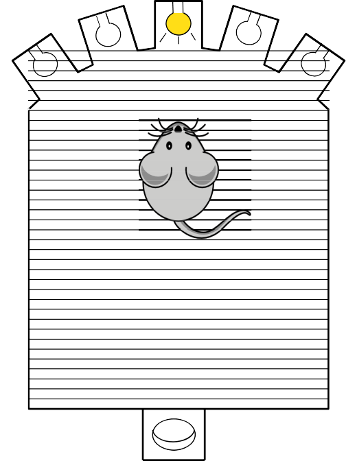

# Serial reaction chamber

  

  

The chamber can be used to observe small rodents response to light stimulus. 

It has holes with a light on one end and a feeding slot with a light in the opposite end. Depending on the behavoiur being experimented the animal needs to poke it's nose into the correct hole and feeding occurs in accordance to the experiemntal rules.

 Its an implementation of a complete behavioural box using BeeHive, off the shelf components and 3D printed parts.
  
---
  
### Hardware:
- Beehive components
    -  ESP32 + central hub
- supporting hardware
    - Reaction Chamber
    - Home chamber
    -  feeder
   
  
### Software:
- micropython on the ESP32
- python (or Bonsai) running data collection on PC.

+ To make the different part of the tool, look in to the following links:
* [Printing list](Printing_list.md "")
* [Food dispenser](testpage1.md "")
* [Reaction chamber](testpage2.md "")

Make sure you start by having the parts in the [bill of materials](index_BOM.md) ([{: .smallicon}](index_BOM.md), [{: .smallicon}](index_BOM.csv)) page.

<!-- GitBuilding Nav -->
---

[Next page](index_BOM.md)