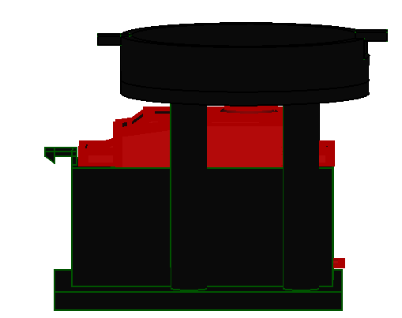
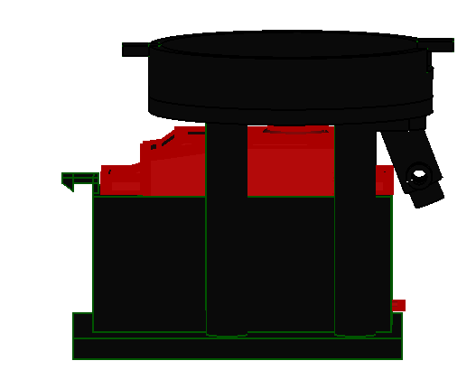
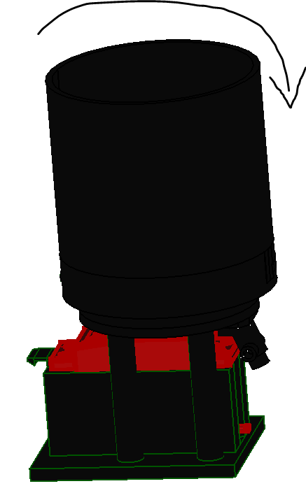
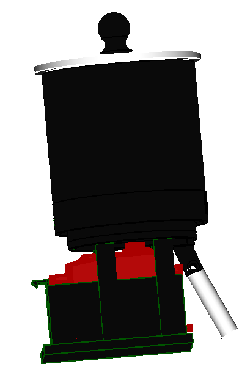

[3d printer]:Parts/3dprinter.md ""
[Servo motor]:Parts/Servomotor.md ""
[Laser cutter]:Parts/Lasercutter.md ""
[PLA filament]:Parts/PLAfilament.md ""
[clear plastic sheet]:Parts/ClearSheet.md ""
[2mm Hex key]:Parts/2mmHexkey.md ""
[Pozidriv PZ1 screw driver]:Parts/PozidrivPZ1.md ""
[M3x8mm hex socket counter sunk screw]:Parts/M3x8mmhexsocketcountersunk.md ""
[Flexible Tube]:Parts/Flexibletube.md ""

# Food dispenser

An automated feeding and storage tank for small animals during lab test. In this project its being used to reward the animal under test. After testing is done the feeding tank should be filled and programed to auto feed mode to ensure the animal is feed as per the diatery requirements.

### Parts 

* 1 [3d printer]{: Class="bom"} 
* 1 [clear plastic sheet]{: Class="bom"} 
* 1 [Flexible Tube]{: Class="bom"} 
* 1 [Laser cutter]{: Class="bom"} 
* 8 [M3x8mm hex socket counter sunk screw]{: Class="bom"} 
* 100 g of [PLA filament]{: Class="bom"} 
* 1 [Servo motor]{: Class="bom"} 

### Tools 

* 1 [2mm Hex key]{: Class="bom"} 
* 1 [Pozidriv PZ1 screw driver]{: Class="bom"} 

 
> You can skip step 1 and 2, if you have purchased the parts.

## Step 1: Printing parts {:id="printing-parts" class="page-step"}

> Please follow the information on your slicing software and remember to add a brim where necessary. 

*  To accomplish this section you will need a [3d printer] and [PLA filament] to print the following parts:

## Step 2: Laser cut parts {:id="laser-cut-parts" class="page-step"}

* To accomplish this section you will need a [Laser cutter] and [clear plastic sheet] to cut the following:
    + [Outer cover](models/Outer_cover.svg "")
    + [Inner cover](models/Inner_cover.svg "")

## Step 3: Assemble the parts {:id="assemble-the-parts" class="page-step"}
1. Push the [Servo motor] on the 3d printed motor holder.

2.  Align the motor holder pillars with the tank base holes and fasten the assembly using[M3x8mm hex socket counter sunk screw] and use [2mm Hex key] to tighten the screws. Make sure the through hole is at the oppsite side of the motor support hook.

3. Align the feed throat with the two holes and the feed throat hole on the base. Then fasten the feed throat with [M3x8mm hex socket counter sunk screw] and tighten uisng [Pozidriv PZ1 screw driver].

4. fit the rotor on the servo motor shaft and fasten it using the [M3x8mm hex socket counter sunk screw].

5. screw the tank on to the tank base. MAke sure the tabs fit in the slots.

6. place the outer cover and inner cover ontop of each other and align the holes with the cover handle. Then fasten them using the [M3x8mm hex socket counter sunk screw] on the cover handle hole.

7. The lid can be placed ontop of the tank to cover the food. The [Flexible Tube] is then press fit on the fed throat.

You made it!

<!-- GitBuilding Nav -->
---

[Previous page](Printing_list.md) | [Next page](testpage2.md)