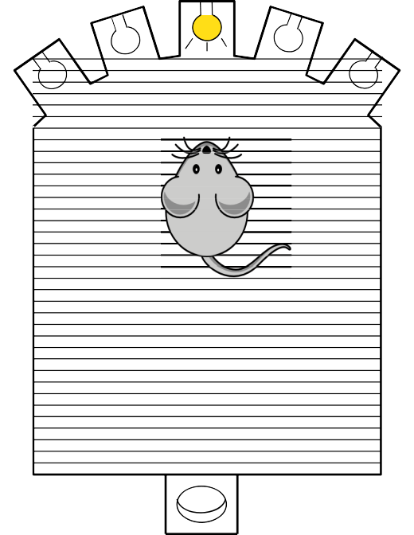

# Serial Reaction Chamber

  

  

The chamber can be used to observe small rodents response to light stimulus. 

It has holes with a light on one end and a feeding slot with a light in the opposite end. Depending on the behavoiur being experimented the animal needs to poke it's nose into the correct hole and feeding occurs in accordance to the experiemntal rules.

 Its an implementation of a complete behavioural box using BeeHive, off the shelf components and 3D printed parts.
  
---

  
### Hardware:
- The supporting hardware for the project:
     * [.](food_dispencer.md){step}
    * [.](reaction_chamber.md){step} 
- Running on the Beehive platform under:
     + [.](Electronics.md){step}  

### Software:
-    The beehive platform uses ESP32 which can run either micropython or C++. 
-     [.](testcode.md){step}  is provided in microPython.
 -   You can also use Bonsai for data collection on PC however this implimentation is not covered under this documentation.

