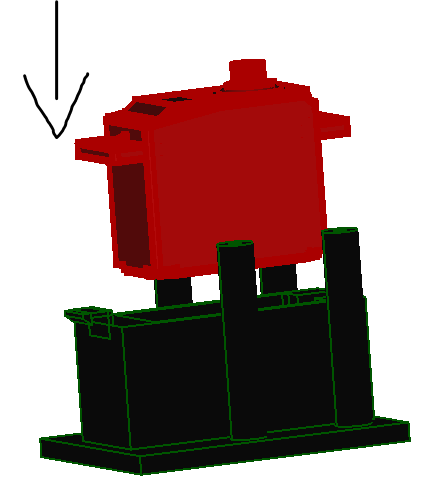
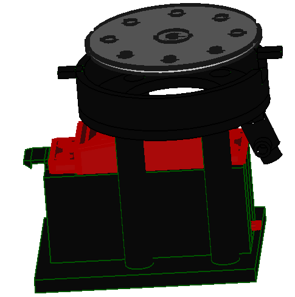
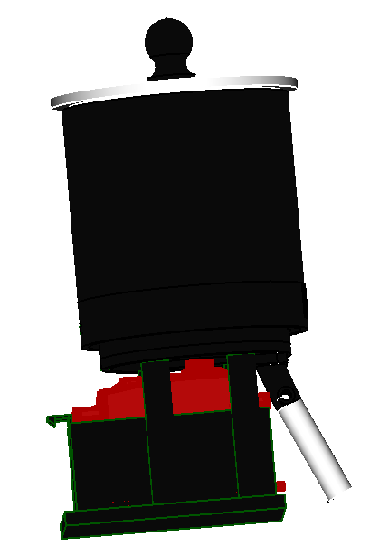

[Servo motor]:Parts.yaml#Servomotor
[clear plastic sheet]:Parts.yaml#ClearSheet
[2mm Hex key]:Parts.yaml#2mmHexkey
[Pozidriv PZ1 screw driver]:Parts.yaml#PozidrivPZ1
[M3x8mm hex socket counter sunk screw]:Parts.yaml#M3x8mmhexsocketcountersunk
[Flexible Tube]: Parts.yaml#Flexibletube

# Assembly Guide

{{BOM}}

## Motor holder {pagestep}

+ Push the [Servo motor]{qty: 1} on the 3d printed [motor holder](models/Motor_holder.stl){previewpage}.

+ Align the motor holder pillars with the [tank base](models/base.stl){previewpage} holes and fasten the assembly using [M3x8mm hex socket counter sunk screw]{Qty:4} and use [2mm Hex key]{Qty:1, cat: tool} to tighten the screws. Make sure the smaller hole on the edge is in line with the servo motor wires

## Feed throat{pagestep}

+ Align the [Chute](models/chute_with_mount.stl){previewpage} with the two holes and the smaller hole on the tank base. Then fasten the feed throat with [M3x8mm hex socket counter sunk screw]{qty:2} and tighten uisng [Pozidriv PZ1 screw driver]{Qty: 1, cat: tool}.

## Tank{pagestep}

+ Fit the [rotor](models/Rotor.stl){previewpage} on the servo motor shaft and fasten it using the [M3x8mm hex socket counter sunk screw]{Qty:1}.

+ screw the [feed tank](models/Feed_tank.stl){previewpage} on to the tank base. Make sure the tabs fit in the slots.

## Cover{pagestep}

+ Place the [outer cover](models/Outer_cover.svg) and [inner cover](models/Inner_cover.svg) on top of each other and align the holes with the [cover handle](models/Handle.stl){previewpage}. Then fasten them using the [M3x8mm hex socket counter sunk screw]{qty:1} on the cover handle hole.

+ The lid can be placed ontop of the tank to cover the food. The [Flexible Tube]{qty:1, cat: material} is then press fit on the fed throat.

You made it!