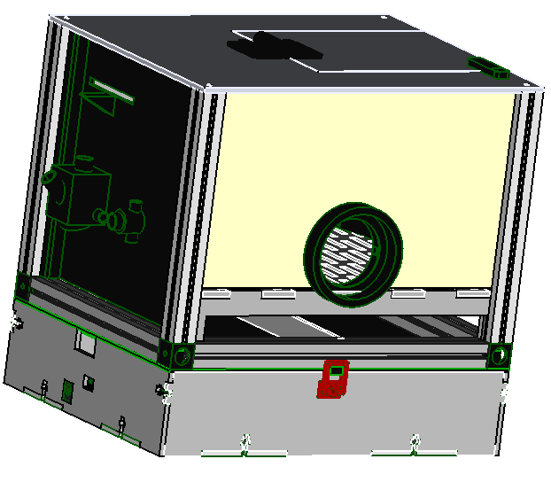

[3d printer]:Parts.yaml#3dprinter
[Laser cutter]:Parts.yaml#Lasercutter
[PLA filament]:Parts.yaml#PLAfilament
[clear plastic sheet]:Parts.yaml#ClearSheet
[maker beam XL]:Parts.yaml#MakerBeamXL
[150mm mini hacksaw]:Parts.yaml#Hacksaw
[M3 tap set]:Parts.yaml#M3tapset
[tap wrench]:Parts.yaml#Tapwrench
[2mm Hex key]:Parts.yaml#2mmHexkey
[Pozidriv PZ1 screw driver]:Parts.yaml#PozidrivPZ1
[M3x8 Pozi pan machine screw]:Parts.yaml#M3X12mmPozipanscrews
[M3 hex Nut]:Parts.yaml#M3hexnut
[Liquid Adhesive]:Parts.yaml#Adhesive

# Reaction chamber

The chamber is used to track mice reaction time using light as a training cue. We will cover the step by step process of making the chamber in this section. 
>i [3d printer]{qty: 1, cat:machine} and  [Laser cutter]{qty: 1, cat:machine}  are OPTIONAL. If you dont have them you can outsource the services from your local supplier. 

{{BOM}}

>i If you have outsourced the printed and laser cut parts.  You migth need to inform your supplier to have  [PLA filament]{Qty: 400g, cat: material} for printing and [clear plastic sheet]{Qty: 1, cat: material} for laser cutting.

## Electronics box{pagestep}
 + Using a laser cutter, cut the following parts:
     + 1 pc of [Ecase_Back](models/Ecase_Back.svg)
     + 1 pc of [Ecase_Base](models/Ecase_Base.svg)
     + 1 pc of [Ecase_Front](models/Ecase_Front.svg)
     +  2 pcs of [Ecase_R&L](models/Ecase_RnL.svg)

   + Assemble the Electronics box with the laser cut parts to form a box then fasten the box with [M3 hex Nut]{Qty:12} and  [M3x8 Pozi pan machine screw]{Qty:12} using [Pozidriv PZ1 screw driver]{qty:1,cat:tool} to tighten the nuts.

## Electronics board{pagestep}

   + Position the Pcb board in line with the holes on the side of the box assembly. Then using  [M3x8 Pozi pan machine screw]{Qty:4}fasten the board using  [Pozidriv PZ1 screw driver]{qty:1,cat:tool} to tighten the screws.

## Electronics cover{pagestep}

  + Print the two models below
 

>! Do not print the latch_assembly.stl as one part 

   + Snap fit the latch_handle.svg on to the latch_base.svg part to from the [Latch_assembly](models/Latch_assembly.stl){previewpage}.

 + Locate the holes on the side of the box and using [M3 hex Nut]{Qty:2} and [M3x8 Pozi pan machine screw]{Qty:2} fasten the assembled latch to the box uisng [Pozidriv PZ1 screw driver]{qty:1,cat:tool}.   

   

 + Place the [Electronics top](models/Electronics_top.stl){previewpage} on top of the box and fasten it using the latch assembly.

## Maker beam frame{pagestep}

 + Using [150mm mini hacksaw]{Qty:1,cat: Tool} cut 2 pcs 200mm long and 6 pcs 150mm long from the [maker beam XL]{Qty:1,cat: material}
 
  + From the [M3 tap set]{Qty:1,cat: Tool} place the taping screw on the [tap wrench]{Qty:1,cat: Tool} then make threads on the holes at the end of the maker beam xl pieces that you had cut ealier. 

  + Place 2 makerbeam xl 200mm and 150 mm end to end at their meeting point joing them together using [corner](models/corner.stl){previewpage}. to make a square frame. Using [M3x8 Pozi pan machine screw]{Qty:12} fasten the corners to the maker beam xl uisng [Pozidriv PZ1 screw driver]{qty:1,cat:tool}. Repeat the process for all the corners to make a rectangle.

  

  + At the corners of the square frame fasten horizontally 4 more maker beam xl using [M3x8 Pozi pan machine screw]{Qty:4}.  

## Adding the enclosure{pagestep}

 + Slide the [platform support](models/Platform_support.svg) parts on opposite sides of the pillars and on top of them place the [Platform base](models/Platform_base.svg).

 + Slide the [feeding wall](models/Feeding_wall.stl){previewpage} making sure it goes all the way to the bottom. Then for the [led series wall](models/Led_series_wall.stl){previewpage} will slide up to the platform and on top of it slide the [curved wall](models/Curved_wall.stl){previewpage}.
.

+ With the [side entry wall](models/Side_entry_wall.svg) press fit the [tunnel connector](models/Tunnel_connector.stl){previewpage} and the [tunnel clamp](models/Tunnel_clamp.stl){previewpage} on either side of the plasric sheet.

+ Slide the [side entry wall](models/Side_entry_wall.svg) and the [side plain wall](models/Side_plain_wall.svg) through the pillars of the box.

+ With the [lid](models/Lid.svg) pieces, [hinge](models/Hinge.stl){previewpage}, [trap latch](models/Trap_latch.stl){previewpage} and [groove pins](models/Grooved_pin.stl){previewpage}. Locate the holes on the lid and allign the hinge and latch then press fit the groove pins on the holes to fasten the latch and hinge on the clear sheet.

+ Place the assembled lid on the box assembly. Then using [M3x8 Pozi pan machine screw]{Qty:4} fasten the lid tightening the screws using [Pozidriv PZ1 screw driver]{qty:1,cat:tool}.  

+ On the bottom of the box along the makerbeam xl groove slide the [guide rail](models/Guide_rail.svg) and make sure it is at the middle and fits tightly.

## Excrete panel{pagestep}

+ Using the Excrete box case parts [case back](models/Excrete_panel_RnL.svg), [case base](models/Excrete_panel_base.svg),[case front](models/Excrete_panel_RnL.svg), [case right](models/Excrete_panel_FnB.svg), [case left](models/Excrete_panel_FnB.svg) and [Liquid Adhesive]{Qty: 1 } stick the parts together and waith for them to dry.

## Putting things together{pagestep}

+ Place the box assembly on top of the electronics case and close the latches to make the assembly stable.

+ The assembled tray in should slid on the assembly in the assembly to make a collector for the animal excretion during experiment.

